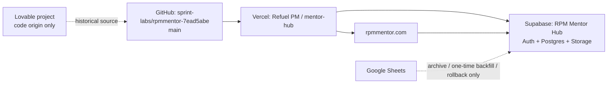

# RPM Mentor Hub: live operating guide

This is the durable handoff for the live RPM Mentor Hub. It is written for the owner and for coding agents such as Cursor. It records the verified live baseline on **11 August 2026**. Re-verify the branch, deployment, and backend before a production action.

## Start here

| Area | Current authority | Safe link |
| --- | --- | --- |
| Live application | `https://rpmmentor.com` | [Open RPM Mentor Hub](https://rpmmentor.com) |
| Application sign-in | RPM Supabase Auth | [Sign in](https://rpmmentor.com/login) · [Set/reset password](https://rpmmentor.com/reset-password) |
| Source repository | `sprint-labs/rpmmentor-7ead5abe` | [GitHub repository](https://github.com/sprint-labs/rpmmentor-7ead5abe) |
| Live branch and source | `main` at the live deployment's recorded commit | [GitHub main](https://github.com/sprint-labs/rpmmentor-7ead5abe/tree/main) |
| Hosting and deployment | Vercel team **Refuel PM**, project **mentor-hub** | [Vercel project](https://vercel.com/gkhq/mentor-hub) · [Deployments](https://vercel.com/gkhq/mentor-hub/deployments) · [Environment variables](https://vercel.com/gkhq/mentor-hub/settings/environment-variables) |
| Production database and auth | Supabase project **RPM Mentor Hub**, Sprint Labs UK Org, London | [Supabase project](https://supabase.com/dashboard/project/zdxxezquhvpjmoxlecjp) · [API endpoint](https://zdxxezquhvpjmoxlecjp.supabase.co) · [Users](https://supabase.com/dashboard/project/zdxxezquhvpjmoxlecjp/auth/users) · [API keys](https://supabase.com/dashboard/project/zdxxezquhvpjmoxlecjp/settings/api-keys) |
| Historical code origin | Lovable project `09000fc3-6e10-463a-b90f-7b0d3fb20b5a` | [Lovable project](https://lovable.dev/projects/09000fc3-6e10-463a-b90f-7b0d3fb20b5a) |

Do not put passwords, private API keys, service-role keys, or copied environment-variable values in this file, Cursor chat, GitHub, or a commit. Use the account pages above and a password manager.

## What is live

The Vercel project `mentor-hub` serves `rpmmentor.com` and `www.rpmmentor.com`. At this verification point, the latest production deployment was **Ready** and was rebuilt from commit `8bf4b377ccf5983a51ccd94db331bd3693638008` (`Fix live logo asset`). The Vercel project identifies the framework as `tanstack-start-lovable`.

The live runtime uses the standalone Supabase project `zdxxezquhvpjmoxlecjp`, named **RPM Mentor Hub**, in `eu-west-2` (London). It is active and healthy. The public API URL is the standard project URL for that project. The former Lovable Cloud database is not the Vercel runtime backend.



### Account map

- **GitHub:** repository owner is the `sprint-labs` organisation. The Vercel deployment metadata identifies the current commit author/login as `lukeylumwork-dot`. Sign in through GitHub normally; this guide intentionally stores no password.
- **Vercel:** use the **Refuel PM** team and the **mentor-hub** project. The connected Vercel account displayed during the live deployment is `lukey-lum-labs`. Production is the `Production` environment; preview settings are separate.
- **Supabase:** use the existing Supabase account that can access the **Sprint Labs UK Org** and its **RPM Mentor Hub** project. The application has one provisioned Super Admin at this snapshot. Additional mentor accounts are not assumed to exist until deliberately invited/provisioned.
- **Lovable:** this remains the code-generation/origin workspace. It is not the control plane for `rpmmentor.com` after the Vercel cutover. Do not connect Vercel to a different Lovable preview just because it resembles the app.

### Related products that must stay separate

- **GKHQ** is a different product and repository. Its Supabase project was paused during the RPM recovery; it was not deleted. Do not repoint RPM to it.
- **Split Decision** is a separate live site. Do not pause, delete, move, or reuse it for RPM.
- The old `rpmmentor.lovable.app` and any `preview--...lovable.app` address are not the production authority for this app.

## Credentials and environment configuration

Vercel, not the repository, holds the active runtime values. The names below are safe to document; their values are not.

| Variable | Scope | Purpose |
| --- | --- | --- |
| `VITE_SUPABASE_URL` | browser build | Public Supabase API URL injected by Vite at build time |
| `VITE_SUPABASE_PUBLISHABLE_KEY` | browser build | Public Supabase browser key |
| `VITE_SUPABASE_PROJECT_ID` | browser build / MCP integration | RPM Supabase project reference |
| `SUPABASE_URL` | server | Supabase API URL for server code |
| `SUPABASE_PUBLISHABLE_KEY` | server auth middleware | Validates the signed-in user's bearer token |
| `SUPABASE_SERVICE_ROLE_KEY` | server only | Privileged server operations; never put it in `VITE_*`, source, or chat |
| `SUPABASE_PROJECT_ID` | server/config compatibility | Project reference used by the existing integration setup |

Set the relevant values in both **Production** and **Preview** when changing backend configuration, then redeploy. Vite values are compiled into the browser bundle, so a redeploy is required after changing them.

The checked-in `.env` is a legacy, tracked file containing configuration names from the older setup. Do not treat it as production truth, do not paste it into an AI, and do not copy its values into Vercel. A separate security cleanup should remove it from Git history/working configuration and rotate anything that was sensitive; do not do that as part of an unrelated feature change.

## Application and database behaviour

### Front end

- **Framework:** React 19, TanStack Start, TanStack Router and React Query.
- **Build tool:** Vite 7 with the Lovable TanStack configuration.
- **Styling/UI:** Tailwind 4, Radix primitives, Lucide icons and the custom dark football-operations design system.
- **PWA:** `vite-plugin-pwa` with a hand-authored `public/manifest.webmanifest`; service-worker caching is deliberate. Login, password reset, server APIs, MCP endpoints and well-known routes are excluded from navigation fallback.
- **Routes:** file-based pages live in `src/routes/`; `src/routeTree.gen.ts` is generated. Do not hand-edit the generated tree.

### Server and auth

- `src/start.ts` wires global error handling and Supabase authentication attachment into TanStack Start.
- `src/server.ts` normalises a class of SSR/Nitro failures to a useful HTML error page rather than a swallowed JSON 500 response.
- `src/integrations/supabase/client.ts` is the browser client and consumes only the Vite public variables.
- `src/integrations/supabase/client.server.ts` is the privileged server client and requires `SUPABASE_SERVICE_ROLE_KEY`.
- `src/integrations/supabase/auth-middleware.ts` validates bearer tokens for server functions. It uses the server URL and publishable key with the caller's token, so Row Level Security remains relevant.
- Roles are `super_admin`, `admin`, `mentor_manager`, and `mentor`. The server checks roles from `public.user_roles`; it never trusts a role sent by the browser.

### Database and source of truth

All 18 public tables are RLS-enabled. The most important live counts at this snapshot are:

| Data | Live count / state |
| --- | --- |
| `players` | 113 |
| `match_reports_cache` | 95 canonical Match Reports |
| `match_report_submissions` | 11 submission-ledger records |
| `profiles` / `user_roles` | 1 / 1 (the first Super Admin) |
| `interactions`, `calendar_events`, `interaction_media` | 0 / 0 / 0 |
| `media_assets` / `report_attachments` | 12 metadata records / 7 links |

`public.match_reports_cache` is the canonical Match Report store despite its historic `_cache` name. `src/lib/match-reports/store.server.ts` is the one persistence module for reports; `reports.functions.ts` reads, writes and soft-deletes there. `match_report_submissions` provides the idempotency/duplicate ledger. Google Sheets is a dormant archive, one-time backfill input and rollback reference only. It must not be reintroduced into normal reads or writes.

The current database was recreated from the repository's historical migrations with security-minded adjustments. Crucially, its `handle_new_user()` function creates a profile but **does not automatically grant a role**. Provision a role deliberately. Do not assume older source comments saying that a default mentor role is seeded are still true.

The repository contains 30 historical SQL migration files while the live project currently reports 26 applied migration entries. This is a controlled source/runtime drift risk, not permission to run all migrations against production. Before any schema, Auth, RLS, trigger, policy, storage or data change: inspect the live target, prepare a forward-only migration, review it, back up/validate the affected data, and obtain explicit production approval.

### Why the code looks this way

The project began in Lovable, which explains the remaining `@lovable.dev/*` dependencies, generated Supabase integration files, MCP routes, asset metadata and the original README wording. It was then adapted into a GitHub/Vercel/TanStack Start application.

Several seemingly unusual pieces are intentional:

- `vite.config.ts` aliases the Lovable MCP package to `src/lib/vercel-mcp-stub.ts` during Vercel builds. The original package reaches a Cloudflare-only import; removing the alias can break Vercel builds.
- Server-only Supabase imports are often dynamic inside TanStack server-function handlers. This avoids the server-function splitter removing or bundling code incorrectly.
- The SSR wrapper and error capture code exist because Nitro can turn some thrown handlers into unhelpful JSON 500 responses.
- `MAINTENANCE_MODE` is currently `false` in `src/lib/maintenance.ts`. This is the normal live state. It is an emergency/recovery gate; enable it only with explicit production-incident approval and confirm that a genuine Super Admin still has access.
- Match Report identifiers, duplicate windows, ledger records and soft deletion are deliberately defensive because the history contains legacy Sheet-era identities and duplicate fixtures. Preserve these invariants when changing report code.

## Safe Cursor workflow

The repository now contains `AGENTS.md` and `.cursor/rules/rpm-mentor-hub.mdc`. They are the always-on rules for an AI working locally. Use this operating loop instead of asking an AI to make a blind live change:

1. **Open the correct repository.** Confirm `origin` is `https://github.com/sprint-labs/rpmmentor-7ead5abe.git`, update from `origin/main`, inspect `git status`, and create a branch named for one task.
2. **Read context first.** Require the agent to read `AGENTS.md`, this guide, the affected route/server function, and the relevant tests before proposing edits.
3. **Plan one focused change.** The plan must name files, expected behaviour, permissions/data impact, acceptance criteria and tests. If it touches database, RLS, Auth, roles, storage, environment variables, deployment or production data, stop for explicit owner approval.
4. **Implement locally.** Keep changes focused. Do not edit generated files unless regeneration is part of the approved task. Do not change historical migrations; add a new forward-only migration only when approved.
5. **Verify honestly.** Run the focused test suite. For runtime/build changes run `npm run build`; also run `git diff --check`. If a broader baseline test/lint failure is unrelated, identify it precisely rather than claiming the suite is green.
6. **Commit a small unit.** Review the diff, use one descriptive commit, and report the commit SHA, checks run, checks not run, and known limitations. The agent may make a local commit; pushing, merging and deploying remain owner-controlled actions.
7. **Release only with evidence.** Before a production release, check the actual Vercel project/domain, target Supabase project, required environment names, migration state, and post-deploy runtime logs. A local build or a Git commit does not prove production behaviour.

### Copy-ready first prompt for Cursor

```text
You are working only in sprint-labs/rpmmentor-7ead5abe. Read AGENTS.md and
docs/RPM-LIVE-OPERATING-GUIDE.md before doing anything. Confirm the current
branch, origin, HEAD SHA and git status. Then inspect the relevant existing
code and tests and give me a concise plan with files, acceptance criteria,
permission/data impact and tests.

You may create a local branch, edit code, run tests/builds and make one local
commit after I approve the plan. Do not push, merge, deploy, edit Vercel,
change Supabase Auth/RLS/data, run a production migration, invite users, alter
DNS, or expose any credential. Treat match_reports_cache as the canonical
report store and Google Sheets as archive/backfill only. If the work touches a
production boundary, stop and ask.
```

## Practical commands

```sh
git fetch origin
git switch main
git pull --ff-only origin main
git status --short
npm ci
npm test
npm run build
git diff --check
```

Use `npm run lint` only with context: the repository has a historical formatting/lint baseline, so a broad lint result is not by itself proof that a focused change is wrong. For a scoped repair, run the relevant tests and report all failures accurately.

## Before you change production

Use this short release gate:

- Correct product: RPM Mentor Hub, not GKHQ, Split Decision, Lovable preview or an old backend.
- Correct GitHub remote, branch and intended commit.
- Correct Vercel project: Refuel PM / `mentor-hub`; correct environment; current deployment is ready.
- Correct Supabase project: RPM Mentor Hub in Sprint Labs UK Org, not the old Lovable database.
- No secrets in the diff, terminal transcript, issue, screenshot or chat.
- Data migration: explicit target tables, backups/read-back checks, RLS/role impact and rollback plan.
- Match Report change: preserve canonical-store, ledger, idempotency, duplicate and soft-delete behaviour.
- Post-release: test the actual live URL and inspect Vercel runtime errors/logs for the deployed release.

## Current known follow-ups

1. Deliberately provision the remaining RPM mentor accounts only after their real email addresses/inboxes exist; assign roles through the Super Admin flow, never by sharing a common password.
2. Keep maintenance mode off during normal operation; re-enable it only for a documented incident and after testing its Super Admin access path.
3. Reconcile the repository's migration history with the live database into a reviewed forward-only baseline before the next schema project.
4. Verify/copy the underlying media objects and any desired historical interaction/calendar records separately. Their metadata/history is not proof that every original storage object or auth-linked record migrated.
5. Remove the legacy tracked `.env` safely and rotate any affected credentials in a dedicated security change.
6. **Leaked-password protection (HaveIBeenPwned)** — Supabase Security Advisor flag remains until the RPM project is on **Pro plan or above**. The Management API rejects `password_hibp_enabled` on the current plan with: *"Configuring leaked password protection via HaveIBeenPwned.org is available on Pro Plans and up."* After upgrade: [Auth → Email provider settings](https://supabase.com/dashboard/project/zdxxezquhvpjmoxlecjp/auth/providers?provider=Email) → enable **Prevent use of leaked passwords** → Save. Billing: [Supabase org dashboard](https://supabase.com/dashboard/org/atsofgtvhfjmcevxkmer).
7. **`list_mentor_directory()` security lint** — The function now rejects callers who are not `mentor`, `mentor_manager`, `admin`, or `super_admin`. Supabase may still surface `authenticated_security_definer_function_executable` because `authenticated` retains `EXECUTE` on a `SECURITY DEFINER` RPC; that is required for calendar/insights reads from the browser client.

### 22 Aug 2026 — Matt Beadle feedback (completed)

| Item | Status |
| --- | --- |
| Voice note text doubling on interactions | Shipped in PR #50 (`autoApply` hides duplicate append controls) |
| External goalkeepers on training visits | Shipped in PR #50 (`Goalkeeper not on RPM?` form path) |
| Media page goalkeeper filter (mock roster) | Shipped in PR #46 |
| `/robots.txt` SPA 404 | Shipped in PR #49 — live returns `200` with `Disallow: /` |
| **Kjell Scherpen / Christian Walton mis-attribution** | **Corrected in live `public.interactions`** — interaction `8ccbb8b5-3e03-4a7f-9348-0936775e4a97` now reads **Kjell Scherpen**, `player_id` null, club **Brighton & Hove Albion**. The separate Walton training visit (`36f14cdc-…`) was left unchanged. |
